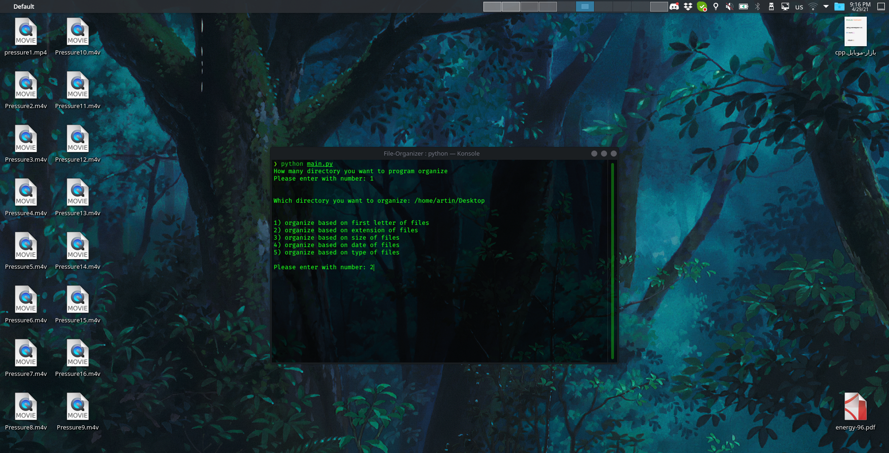
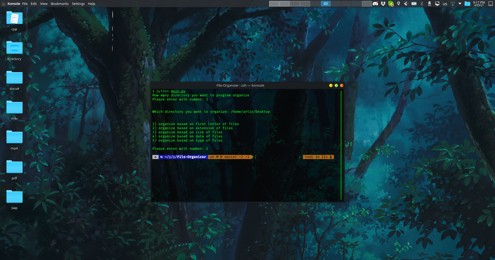

# file-organizer

Small program that can organize your files

## Usage

This program will organize your files(obviously)¯\\_(ツ)_/¯.
This program will takes number of directories that needed to be sorted then takes the address of directory needed to be sorted and after that takes how to sort that directory and will organize that directory and it will do same process again and again and again.

## Example of organizing

For example I want to organize my 'Desktop' directorys. I want to organize 'Desktop' based on files extension

##### Before organizing

##### After organizing

## License

[MIT](https://choosealicense.com/licenses/mit/)
